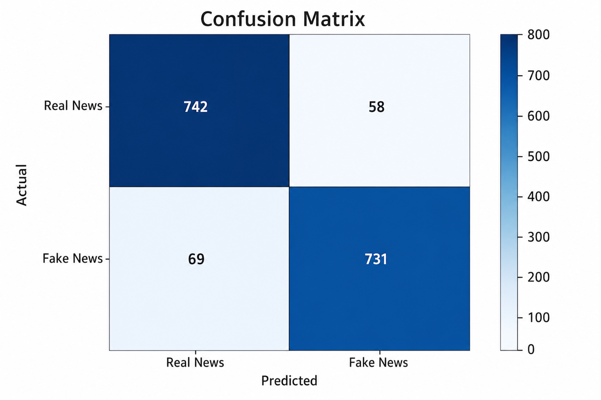

# Fake News Detection using NLP & Machine Learning

## Overview
This project detects whether a news article is fake or real using Natural Language Processing (NLP) and Machine Learning techniques.

The text data is preprocessed, transformed using TF-IDF Vectorization, and classified using Logistic Regression.

---

## Technologies Used
- Python
- Pandas
- NumPy
- Scikit-learn
- NLTK
- Matplotlib
- Seaborn

---

## Workflow
1. Data Cleaning
2. Text Preprocessing
3. TF-IDF Vectorization
4. Model Training
5. Model Evaluation

---

## Machine Learning Model
- Logistic Regression

---

## Features
- Fake/Real news classification
- TF-IDF text vectorization
- NLP preprocessing
- Accuracy evaluation
- Confusion matrix visualization

---

## Confusion Matrix

## Results
The model achieved good classification accuracy on the testing dataset.

---

## Future Improvements
- Deploy using Streamlit
- Use advanced NLP models
- Add real-time news prediction
